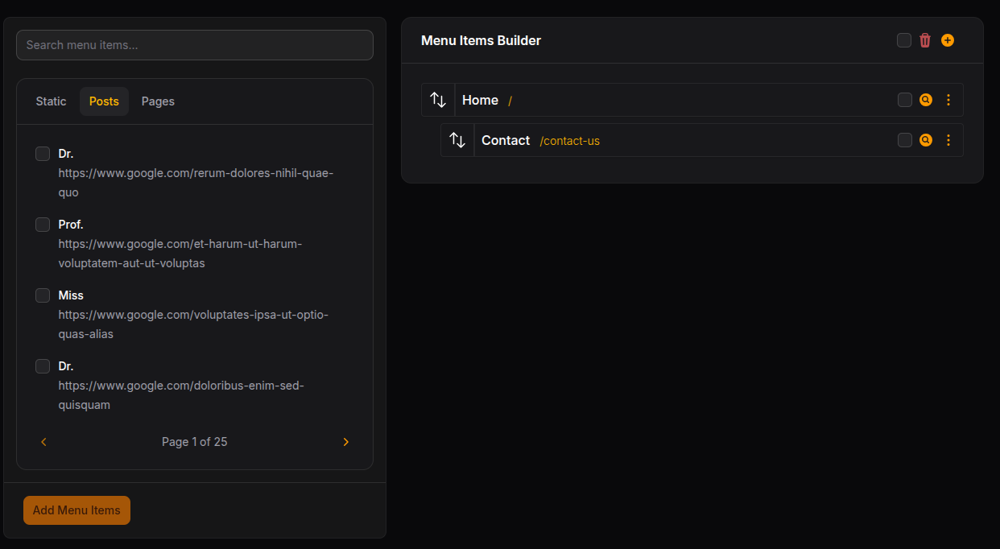

# Good or bad, you decide.

[](https://packagist.org/packages/acerex/filament-menux)
[](https://github.com/acerex/filament-menux/actions?query=workflow%3Arun-tests+branch%3Amain)
[](https://github.com/acerex/filament-menux/actions?query=workflow%3A"Fix+PHP+code+styling"+branch%3Amain)
[](https://packagist.org/packages/acerex/filament-menux)

Inspired by existing menu builders, but simplified and easier to customize. Most of the customizations might
look trivial, but having to roll your own custom resource and extending the plugin's classes to customize these little
things can sometimes become a pain-in-ass (At least in my experience).

## Table of Contents

- [Installation](#installation)
- [Registering to panel](#registering-to-panel)
- [Static Menus](#static-menus)
- [Static Menu Items](#static-menu-items)
- [Add Model-Based Menu Items](#add-model-based-menu-items)
- [Modifying the Base Resource Class](#modifying-the-base-resource-class)
- [Custom Forms And Tables](#custom-forms-and-table)
- [Using Custom Link Target Enum](#using-custom-link-target-enum)

## Installation

You can install the package via composer:

```bash
composer require acerex/filament-menux
```

You can publish and run the migrations with:

```bash
php artisan vendor:publish --tag="filament-menux-migrations"
php artisan migrate
```

Optionally, you can publish the views using

```bash
php artisan vendor:publish --tag="filament-menux-views"
```

## Usage

To start using, add the plugin to the panel you want.

```php
FilamentMenuxPlugin::make()
    ->useStaticMenus([
        'header' => 'Header',
        'footer' => 'Footer',
        ])
    ->addStaticMenuItem('Home', '/')
    ->setNavigationLabel('Custom Menu Label')
    ->setPerPage(4)
    ->setActionModifierUsing(MenuxActionType::EDIT_MENU_ITEM, function (Action $action) {
        return $action->icon(Heroicon::MagnifyingGlassCircle);
    })
    ->addMenuxableModel(Post::class)
    ->setResourceNavigationGroup('Custom Menu Group')
    ->addStaticMenuItem('Contact Us', '/contact-us')
    ->setLinkTargetEnum(linkTargetEnum: LinkTarget::class)
    ->addMenuxableModel(model: Page::class),

```

## Registering to panel

Just like any other panel plugins, you can register this in your panel provider

```php
->plugins([
    \AceREx\FilamentMenux\FilamentMenuxPlugin::make()
])
```

## Static Menus

With static menus you can limit how many menus can be created except the menus you provided.
This is useful, especially for projects where the frontend fetches the menus statically via slug.
To pass static menus, you pass the menus to the **useStaticMenus** method. After that the plugin will try to create the
static menus automatically if the slug is not in the database on boot.

```php
\AceREx\FilamentMenux\FilamentMenuxPlugin::make()
    ->useStaticMenus([
        'slug'=>'label',
        'header'=>"Header"
    ])
```

## Static Menu Items

Static menu items are shown menu items that you provide from the panel configuration.
You can add static menu items like this.

```php
->addStaticMenuItem('Home', '/', '_self')
 ```

The third argument is optional and can also be any type of backed enum. For consistency, you should
use the enum you use for the item form. See [Using custom link target enum](#using-custom-link-target-enum)

## Add Model-Based Menu Items

Inspired by [Menu Builder](https://filamentphp.com/plugins/datlechin-menu-builder) by
Ngô Quốc Đạt, this plugin supports registering models and rendering them into menu item list selection.

```php
->addMenuxableModel(Post::class)
```

The model must implement interfaces;

```php
\AceREx\FilamentMenux\Contracts\Interfaces\Menuxable
```

For example;

```php
class Post extends Model implements Menuxable
{
    /** @use HasFactory<\Database\Factories\PostFactory> */
    use HasFactory;

    protected $fillable = [
        'title',
        'slug',
    ];

    public static function getMenuxLabel(): string
    {
        return 'Posts';
    }

    public function getMenuxTitle(): string
    {
        return $this->title;
    }

    public function getMenuxUrl(): string
    {
        return "https://www.google.com/{$this->slug}";
    }

    public function getMenuxTarget(): BackedEnum
    {
        return MenuxLinkTarget::SELF;
    }

    public static function getMenuxablesUsing(?string $q, Builder $builder): Builder
    {
        if (filled($q)) {
            return $builder->whereLike('title', $q);
        }

        return $builder;
    }
}

```



#### Set Records Per Page For Menu-Based Menu Items

By default, all menuxable menus are paginated with four records per page. However, you can customize this
by providing the number of records you want to query per page via:

```php
->setPerPage(4)
```

## Modifying the Base Resource Class

The plugin supports modifying the base resource class without having to extend the base class.

#### Navigation Group

To Set navigation group of the resource, you can do it like this:

```php
->setResourceNavigationGroup('Group')
```

#### Navigation Label

To Set the navigation label of the resource, you can do it like this:

```php
->setNavigationLabel('Label')
```

#### Navigation Icon

To set the navigation icon of the resource, you can do it like this:

```php
->setNavigationIcon(\Filament\Support\Icons\Heroicon::AcademicCap)
```

## Custom Forms and Table

The plugin also allows you to set custom form and table.

#### Custom Menu Form With Traditional Class

```php
->setMenuForm(CustomForm::class)
```

The custom form must extend the plugin's ```MenuForm``` class.
For example:

```php
use AceREx\FilamentMenux\Filament\Resources\Menus\Schemas\MenuForm as BaseMenuForm;
use Filament\Forms\Components\TextInput;

class MenuForm extends BaseMenuForm
{
    public static function configure(): array
    {
        return [
            TextInput::make('name'),
        ];
    }
}

```

#### Custom Menu Form With Anonymouse Class

Also, you can pass the anonymouse class

```php
->setMenuForm(fn() => new class extends \App\Forms\MenuForm {

    public static function configure(): array
    {
        return [
            Section::make('Menu')
                ->collapsible()
                ->headerActions([
                    DeleteAction::make(),
                    Action::make('save')
                        ->label('Save')
                        ->button()
                        ->action('save'),
                ])
                ->schema([
                    TextInput::make('name')
                        ->label('Name')
                        ->required()
                        ->maxLength(255),
                ]),
        ];
    }
    
});
```

#### Custom Menus Table

You can also pass custom menus table with both traditional class and function that returns anonymouse class that extends
the base MenuTables class,
For example.

```php
->setMenusTable(\App\Tables\MainMenusTable::class)
```

or

```php
->setMenusTable(fn() => new class extends \App\Tables\MenusTable {

    public static function configure(Table $table): Table
    {
        return $table
            ->columns([
                TextColumn::make('name')
                    ->label('Name')
                    ->sortable()
                    ->searchable(),
            ])
            ->filters([
                //
            ])
            ->recordActions([
                \Filament\Actions\DeleteAction::make(),
                \Filament\Actions\EditAction::make()
            ])
            ->toolbarActions([
                BulkActionGroup::make([
                    DeleteBulkAction::make(),
                ]),
            ]);
    }

});
```

## Using Custom Link Target Enum

By default, the plugin uses ```MenuxLinkTarget``` for model cast and inside menu item form.
But sometimes, you would like to show fewer options or modify the labeling. Or add some more functionality.
To do that, you can pass your own enum, and that enum will be used inside the menu item form and the model cast.

```php
->setLinkTargetEnum(linkTargetEnum: LinkTarget::class)
```

The custom enum must implement two interfaces;

```php
\Filament\Actions\Concerns\HasLabel
```

```php
\AceREx\FilamentMenux\Contracts\Interfaces\HasStaticDefaultValue
```

For example

```php
enum LinkTarget: string implements HasLabel, HasStaticDefaultValue
{
    case SELF = 'self';

    public function getLabel(): string
    {
        return match ($this) {
            self::SELF => 'SELF'
        };
    }

    public static function getStaticDefaultValue(): HasStaticDefaultValue
    {
        return self::SELF;
    }

    public function getSomething(): string
    {
        return 'something';
    }
}

```

## License

The MIT License (MIT). Please see [License File](LICENSE.md) for more information.
