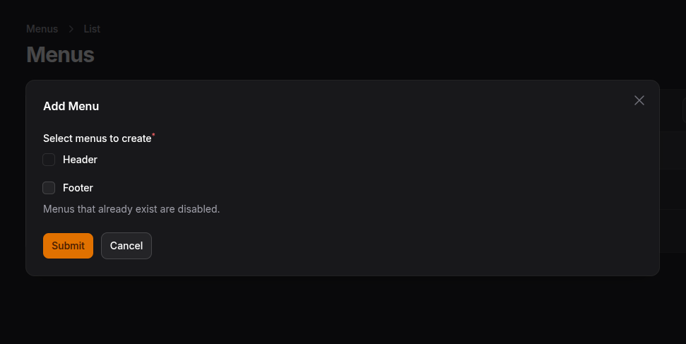

# Filament Menux Documentation

## Table of Contents

- [Introduction](#introduction)
- [Registering to panel](#registering-to-panel)
- [Static Menus](#static-menus)
- [Static Menu Items](#static-menu-items)

## Introduction

Inspired by existing menu builders, but simplified and easier to customize.

## Registering to panel

Just like any other panel plugins, you can register this in your panel provider

```php
->plugins([
    \AceREx\FilamentMenux\FilamentMenuxPlugin::make()
])
```

## Static Menus

With static menus you can limit how many menus can be created except the menus you provided.
This is useful, especially for projects where the frontend fetches the menus statically via slug.
To pass static menus you pass the menus to the **useStaticMenus** method.

```php
\AceREx\FilamentMenux\FilamentMenuxPlugin::make()
    ->useStaticMenus([
        'slug'=>'label',
        'header'=>"Header"
    ])
```



## Static Menu Items

Static menu items are shown menu items that you provide from the panel configuration.
You can add static menu items like this.

```php
->addStaticMenuItem('Home', '/', '_self')

```

The third argument is optional and can also be any type of backed enum. For consistency, you should
use the enum you use for the item form. See [Using custom link target enum](#using-custom-link-target-enum)
